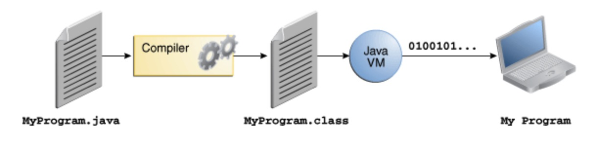

# javaPHP

java与php类比学习

## 一、java是什么

Java编程语言是一种高级语言，可以通过以下所有流行语来表征，同时相比PHP，使用❎⛔️✅：

- Simple【简单】❎
- Object oriented【面向对象】⛔️
- Distributed 【分布式】✅
- Multithreaded【多线程】✅
- Dynamic【动态】❎
- Architecture neutral【架构中立性】✅
- Portable【可移植】⛔️
- High performance【高性能】✅
- Robust【强壮】✅
- Secure【安全】✅

java编译过程：`.java` ->`.class`->`01100`，编译器是JavaVM



php编译过程：`.php`->`opcode`->`01100`，编译器是ZendVM

## 二、安装

### 1、Mac

```bash
// java
brew install java
// php
brew install php
```

### 2、包管理

```bash
// java maven
brew install maven
// php composer
brew install composer
```

## 三、你好，世界

```java
// HelloWorldApp.java
class HelloWorldApp {
    public static void main(String[] args) {
        System.out.println("Hello World!");
    }
}
javac HelloWorldApp.java
java HelloWorldApp
```

```php
// HelloWorldApp.php
<?php
    echo "Hello World!";
php HelloWorldApp.php
```

## 四、面向对象概述

> 楼主说：php的面向对象与java的面向对象基本一致，原因是php借鉴java

对象`object`：类似现实世界的对象，他们都拥有`状态`和关系`行为`。一个对象存储他们的状态在一个`变量`和暴露他们的行为通过`方法`

封装`encapsulation`：隐藏状态并通过方法进行交互

类`class`：我们经常会讲到new一个对象，解读为对象是类的实例，类是对象的蓝图

继承`inherit`：继承来自父类的状态和方法

接口`interface`：制定一套规范方法给类使用

包`package`：命名空间，类似电脑中的文件夹

## 五、语言基础

> 楼主说：java和php基本一致，只是java是强类型语言，需要定义变量的类型

### 1、变量

#### 变量种类

- 实例变量⛔️
- 静态变量✅
- 常量⛔️
- 参数⛔️

#### 主要数据类型

```
// java
float pi = 3.14;
// php
$pi = 3.14;
```

- **byte**
- **short**
- **int**
- **long**
- **float**
- **double**
- **boolean**
- **char**

#### 数组

```
// java
int[] arr = {1,2,3};
int[][] array = {
    {1,2,3},
    {4,5,6},
    {7,8,9}
};
// php
$arr = [1,2,3];
$array = [
    [1,2,3],
    [4,5,6],
    [7,8,9]
];
```

###2、运算符

java和php⛔️

###3、表达式

java和php⛔️

### 4、流程控制

java和php⛔️

## 六、类与对象

### 1、类概述

```java
public class Bicycle {

    // 预定义变量
    public int cadence;
    public int gear;
    public int speed;

    // 构造函数
    public Bicycle(int startCadence, int startSpeed, int startGear) {
        gear = startGear;
        cadence = startCadence;
        speed = startSpeed;
    }

    // 设置踏板
    public void setCadence(int newValue) {
        cadence = newValue;
    }

    // 设置齿轮
    public void setGear(int newValue) {
        gear = newValue;
    }

    // 减速
    public void applyBrake(int decrement) {
        speed -= decrement;
    }

    // 加速
    public void speedUp(int increment) {
        speed += increment;
    }
}

public class MountainBike extends Bicycle {

    public int seatHeight;

    public MountainBike(int startHeight, int startCadence, int startSpeed, int startGear){
        super(startCadence, startSpeed, startGear);
        seatHeight = startHeight;
    }

    public void setHeight(int newValue) {
        seatHeight = newValue;
    }

}
```

```php
<?php
class Bicycle
{
    // 预定义变量
    public $cadence;
    public $speed;
    public $gear;

	// 构造函数
    public function __construct(int $startCadence, int $startSpeed, int $startGear)
    {
        $this->cadence = $startCadence;
        $this->speed = $startSpeed;
        $this->gear = $startGear;
    }

    // 设置踏板
    public function setCadence(int $newValue)
    {
        $this->cadence = $newValue;
    }

    // 设置齿轮
    public function setGear(int $newValue)
    {
        $this->gear = $newValue;
    }

    // 减速
    public function applyBrake(int $decrement)
    {
        $this->speed -= $decrement;
    }

    // 加速
    public function speedUp(int $increment)
    {
        $this->speed += $increment;
    }
}

<?php
class MountainBike extends Bicycle
{
    public $seatHeight;

    public function __construct(int $startHeight, int $startCadence, int $startSpeed, int $startGear)
    {
        parent::__construct($startCadence, $startSpeed, $startGear);
        $this->seatHeight = $startHeight;
    }


    public function setHeight(int $newValue)
    {
        $this->seatHeight = $newValue;
    }
}
```

### 2、对象

```java
public static void main(String[] args) {
    // 实例化对象
    Bicycle myBike = new Bicycle(30, 0, 8);

    System.out.println(myBike.cadence+" "+myBike.gear+" "+myBike.speed);
}

```

```php
// 实例化对象
$bicycle = new Bicycle(30, 0, 8);

echo $bicycle->cadence." ".$bicycle->speed." ".$bicycle->gear."\n";
```

### 3、类进阶

```java
// java可以有多个构造函数，根据参数不同而生成的对象不同
public class Rectangle {
    private int x, y;
    private int width, height;
        
    public Rectangle() {
        this(0, 0, 1, 1);
    }
    public Rectangle(int width, int height) {
        this(0, 0, width, height);
    }
    public Rectangle(int x, int y, int width, int height) {
        this.x = x;
        this.y = y;
        this.width = width;
        this.height = height;
    }
    
}
```

### 4、类嵌套

>

```php
public class ShadowTest {

    public int x = 0;

    class FirstLevel {

        public int x = 1;

        void methodInFirstLevel(int x) {
            System.out.println("x = " + x);
            System.out.println("this.x = " + this.x);
            System.out.println("ShadowTest.this.x = " + ShadowTest.this.x);
        }
    }

    public static void main(String... args) {
        ShadowTest st = new ShadowTest();
        ShadowTest.FirstLevel fl = st.new FirstLevel();
        fl.methodInFirstLevel(23);
    }
}
x = 23
this.x = 1
ShadowTest.this.x = 0
```

### 5、枚举

